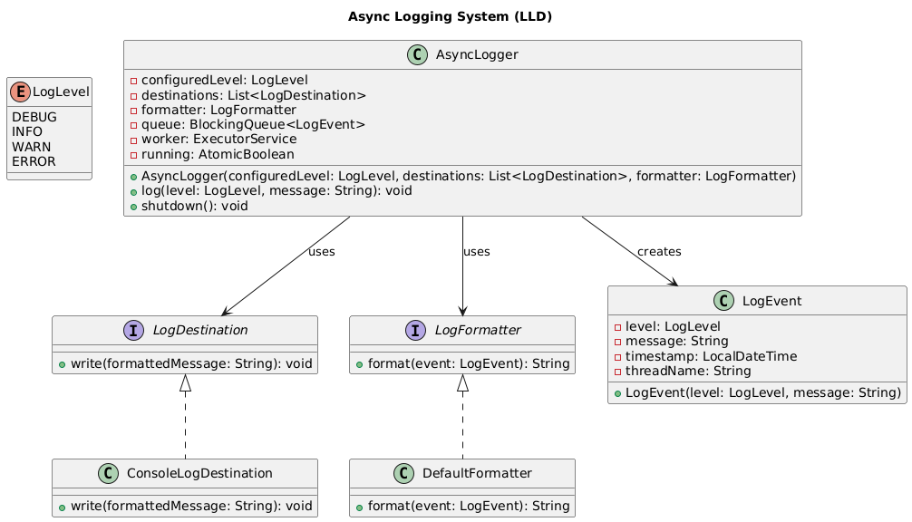
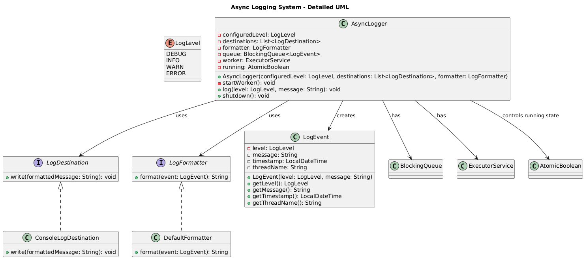

# Logger Implementation

🧩 **Problem Statement (Elaborated)**

Design a thread-safe logging system that:
- Logs messages from multiple threads
- Supports multiple destinations (console, file, remote)
- Supports log levels (INFO, DEBUG, ERROR)
- Allows custom formatters
- High throughput: should not block app threads
- Extensible: add new destinations easily

🧠 **Step 1: Identify Responsibilities → Classes & Interfaces**

| Responsibility | Class / Interface | Why? |
|---|---|---|
| Accept log requests | Logger | Facade; orchestrates logging |
| Filter by log level | Logger | Keeps configured log level |
| Write to destinations | LogDestination (interface) + impls | Open/Closed principle |
| Format messages | LogFormatter (interface) + impls | Strategy pattern |
| Manage concurrency | AsyncLogger with queue & worker thread | Decouple producer/consumer |

✏ **Step 2: Why this design?**
- ✅ **Single Responsibility**: Each class handles one concern
- ✅ **Open/Closed**: Add new destination / format without modifying core
- ✅ **Dependency Inversion**: Logger depends on abstraction
- ✅ **Strategy Pattern**: For formatting
- ✅ **Asynchronous processing**: Improves performance

🏎 **Step 3: Performance & Concurrency**

Use `BlockingQueue<LogEvent>` to decouple:
- **Producer**: app threads enqueue
- **Consumer**: worker thread(s) dequeue & write
- Avoid blocking app threads on slow IO
- Bounded queue to protect memory
- Dedicated thread(s) keep logs in order

## System Architecture



*High-level view showing the asynchronous logging flow and component interactions*

## Package Structure

```
src/main/java/com/lld/logger/
├── core/                    # Core domain objects
│   ├── LogLevel.java       # Log level enumeration
│   └── LogEvent.java       # Log event record
├── destination/            # Log output destinations
│   ├── LogDestination.java # Destination interface
│   └── ConsoleLogDestination.java
├── formatter/              # Log formatting
│   ├── LogFormatter.java   # Formatter interface
│   └── DefaultFormatter.java
├── impl/                   # Logger implementations
│   └── AsyncLogger.java    # Async logger implementation
└── LoggerDemo.java         # Demo application
```

## Class Diagram



*Detailed class relationships showing interfaces, implementations, and dependencies*

## Usage

```java
var logger = new AsyncLogger(LogLevel.INFO, 
    List.of(new ConsoleLogDestination()), new DefaultFormatter());

logger.log(LogLevel.INFO, "Hello World!");
logger.log(LogLevel.DEBUG, "Debug, will skip if configured level is INFO");
logger.shutdown();
```

✅ **Edge Cases & Improvements**
- File rotation
- Retry on failure
- Dynamic log level update
- Metrics: dropped logs, queue size
- Multiple workers for high throughput
- Flush logs gracefully on shutdown

🧠 **Key OOP & Design Patterns**
- **SRP**: Each class one responsibility
- **Open/Closed**: new destination / format
- **Strategy**: different formatters
- **Dependency inversion**: use interfaces
- **Producer-consumer** concurrency pattern

📝 **Summary to remember in interview**
1. Start with simple Logger → realize IO bottleneck
2. Introduce queue + worker thread (producer-consumer)
3. Abstract destinations & formatters → OCP & Strategy
4. Bounded queue → avoid OOM
5. Single worker keeps logs in order; multiple workers increase throughput
