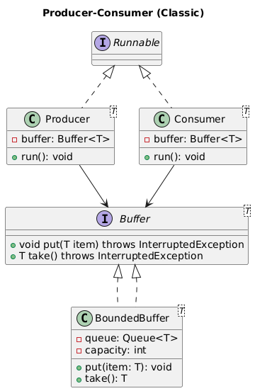

# Producer-Consumer BlockingQueue Implementation

🧩 **Problem statement (expanded for interview):**

Design and implement a classic Producer-Consumer system in Java.
- Multiple producer threads generate data items
- Multiple consumer threads consume data items
- The buffer (queue) has a bounded capacity
- Ensure thread safety, avoid race conditions
- Handle edge conditions: buffer full / empty
- Use modern Java best practices (Java 8+ or latest)
- Write clean, maintainable, object-oriented code

We'll also discuss:
- Why use which classes/interfaces
- How to make it extensible
- What concurrency utilities to use (e.g., BlockingQueue vs wait/notify)

⚙ **Design approach (for discussion):**

✅ **Buffer (shared resource)**
- Class: `BoundedBuffer<T>`
- Holds data items
- Has a capacity limit
- Controls access

✅ **Producer(s)**
- Runnable/Thread that produces items
- Puts into buffer

✅ **Consumer(s)**
- Runnable/Thread that consumes items
- Takes from buffer

🛠 **Implementation Options:**

**Option 1: BlockingQueue (high-level, recommended in real world)**
- Very simple and robust
- Thread safe, handles full/empty automatically
- Good for maintainable, production-ready code
- Implementation: `BoundedBuffer.java`

**Option 2: wait() / notify() (low-level, classic interview)**
- Shows deeper understanding of synchronization
- Manual thread coordination with Object monitors
- Classic approach, great for interview discussions
- Implementation: `BoundedBufferWaitNotify.java`

**Option 3: Semaphore (counting semaphore approach)**
- Uses counting semaphores for capacity management
- Demonstrates semaphore-based synchronization
- Good balance between control and simplicity
- Implementation: `BoundedBufferSemaphore.java`

✅ **In interview: explain:**
- Why you might choose BlockingQueue in production
- Why you show wait/notify in interview for educational value

## Class Diagram



*UML diagram showing the Producer-Consumer pattern structure with Buffer interface and implementations*

## Package Structure

```
src/main/java/com/lld/producerconsumer/
├── buffer/                          # Buffer implementations
│   ├── Buffer.java                 # Buffer interface
│   ├── BoundedBuffer.java          # BlockingQueue implementation
│   ├── BoundedBufferWaitNotify.java # wait/notify implementation
│   └── BoundedBufferSemaphore.java  # Semaphore implementation
├── producer/                        # Producer components
│   └── Producer.java               # Producer thread implementation
├── consumer/                        # Consumer components
│   └── Consumer.java               # Consumer thread implementation
└── ProducerConsumerDemo.java        # Demo application
```

📦 **Implementation Approaches:**
1️⃣ **Interface Design**: `Buffer<T>` interface → clean abstraction
2️⃣ **Three Implementations**:
   - `BoundedBuffer`: High-level BlockingQueue approach
   - `BoundedBufferWaitNotify`: Classic wait/notify with synchronized blocks
   - `BoundedBufferSemaphore`: Counting semaphore-based synchronization
3️⃣ **Thread Components**: Producer and Consumer classes
4️⃣ **Demo**: Multiple producers & consumers with different buffer types

## Usage Examples

**BlockingQueue Implementation:**
```java
Buffer<String> buffer = new BoundedBuffer<>(10);
```

**Wait/Notify Implementation:**
```java
Buffer<String> buffer = new BoundedBufferWaitNotify<>(10);
```

**Semaphore Implementation:**
```java
Buffer<String> buffer = new BoundedBufferSemaphore<>(10);
```

**Common Usage Pattern:**
```java
// Create and start producers
for (int i = 0; i < 3; i++) {
    new Thread(new Producer<>(buffer, "Producer-" + i)).start();
}

// Create and start consumers
for (int i = 0; i < 2; i++) {
    new Thread(new Consumer<>(buffer, "Consumer-" + i)).start();
}
```

✏ **Three Complete Implementations:**
- ✅ **BlockingQueue version** (real-world, production-ready)
- ✅ **wait/notify version** (classic, shows synchronization mastery)
- ✅ **Semaphore version** (counting semaphore approach)

🧠 **Key Concepts Demonstrated:**
- **Thread Safety**: Proper synchronization mechanisms
- **Bounded Buffer**: Capacity management
- **Producer-Consumer Pattern**: Classic concurrency pattern
- **Generic Design**: Type-safe buffer implementation
- **Clean Architecture**: Separation of concerns

📝 **Interview Discussion Points:**
1. **BlockingQueue vs manual synchronization** trade-offs
2. **wait/notify mechanics** and potential pitfalls (spurious wakeups)
3. **Semaphore counting** for resource management
4. **Performance comparison** between different approaches
5. **InterruptedException handling** across implementations
6. **Memory management** and capacity planning
7. **Deadlock prevention** strategies
8. **When to choose which implementation** in real-world scenarios
