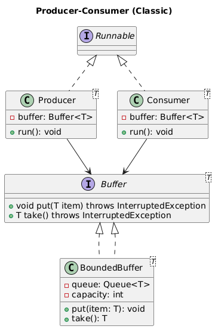

# Producer-Consumer BlockingQueue Implementation

🧩 **Problem statement (expanded for interview):**

Design and implement a classic Producer-Consumer system in Java.
- Multiple producer threads generate data items
- Multiple consumer threads consume data items
- The buffer (queue) has a bounded capacity
- Ensure thread safety, avoid race conditions
- Handle edge conditions: buffer full / empty
- Use modern Java best practices (Java 8+ or latest)
- Write clean, maintainable, object-oriented code

We'll also discuss:
- Why use which classes/interfaces
- How to make it extensible
- What concurrency utilities to use (e.g., BlockingQueue vs wait/notify)

⚙ **Design approach (for discussion):**

✅ **Buffer (shared resource)**
- Class: `BoundedBuffer<T>`
- Holds data items
- Has a capacity limit
- Controls access

✅ **Producer(s)**
- Runnable/Thread that produces items
- Puts into buffer

✅ **Consumer(s)**
- Runnable/Thread that consumes items
- Takes from buffer

🛠 **Option 1: Use BlockingQueue (high-level, recommended in real world)**
- Very simple
- Thread safe, handles full/empty automatically
- Good for maintainable, production-ready code

🛠 **Option 2: Use wait() / notify() (low-level, classic interview)**
- Shows deeper understanding of synchronization
- Harder to get right, but great for interview

✅ **In interview: explain:**
- Why you might choose BlockingQueue in production
- Why you show wait/notify in interview for educational value

## Class Diagram



*UML diagram showing the Producer-Consumer pattern structure with Buffer interface and implementations*

## Package Structure

```
src/main/java/com/lld/producerconsumer/
├── buffer/                     # Buffer implementations
│   ├── Buffer.java            # Buffer interface
│   └── BoundedBuffer.java     # BlockingQueue implementation
├── producer/                   # Producer components
│   └── Producer.java          # Producer thread implementation
├── consumer/                   # Consumer components
│   └── Consumer.java          # Consumer thread implementation
└── ProducerConsumerDemo.java   # Demo application
```

📦 **Step-by-step plan:**
1️⃣ Define `Buffer<T>` interface → clean abstraction
2️⃣ Implement `BoundedBuffer`:
   - Use BlockingQueue OR low-level wait/notify with LinkedList
3️⃣ Create Producer and Consumer classes
4️⃣ In main(): create multiple producers & consumers → start threads

## Usage

```java
// Create bounded buffer with capacity 10
Buffer<String> buffer = new BoundedBuffer<>(10);

// Create and start producers
for (int i = 0; i < 3; i++) {
    new Thread(new Producer<>(buffer, "Producer-" + i)).start();
}

// Create and start consumers
for (int i = 0; i < 2; i++) {
    new Thread(new Consumer<>(buffer, "Consumer-" + i)).start();
}
```

✏ **Implementation Options:**
- ✅ **BlockingQueue version** (real-world, quick, robust)
- ✅ **wait/notify version** (classic, shows mastery)

🧠 **Key Concepts Demonstrated:**
- **Thread Safety**: Proper synchronization mechanisms
- **Bounded Buffer**: Capacity management
- **Producer-Consumer Pattern**: Classic concurrency pattern
- **Generic Design**: Type-safe buffer implementation
- **Clean Architecture**: Separation of concerns

📝 **Interview Discussion Points:**
1. BlockingQueue vs manual synchronization trade-offs
2. Handling InterruptedException properly
3. Graceful shutdown mechanisms
4. Performance considerations with multiple threads
5. Memory management and capacity planning
